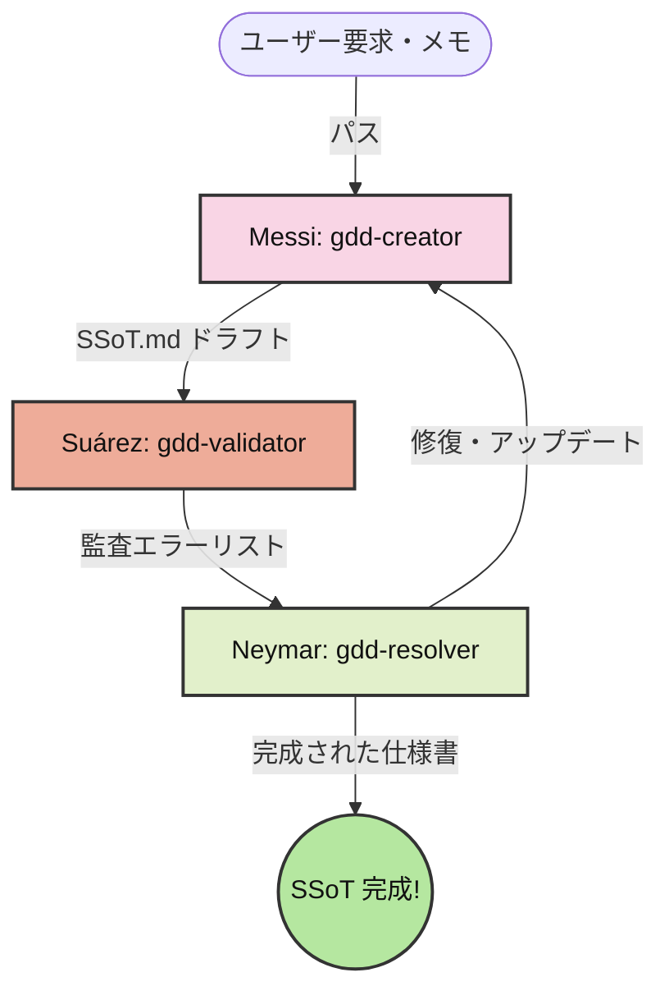

# msn-spec (GDD AI協調スキル)

サッカー史上最強と評される3トップ「MSN」のように、3つの自律的なAIエージェントが抜群のコンビネーションでバグを封じ込め、完璧な仕様書を組み上げるための保証駆動開発（GDD: Guarantee-Driven Development）AIスキルパッケージです。

`npx skills` 規格に準拠しており、Cursor、Claude Code、Clineなどの各種AI搭載IDEにコマンド一発でインストールできます。

---

## ⚽ MSN 協調メタファーコンセプト



### 🇦🇷 Messi (Creator / 仕様作成) — `gdd-creator`
* **役割**: 天才的な視野と高精度なパスで、無から完璧なチャンス（高純度なSSoT設計図）をビルドアップする。
* **機能**: 雑多なメモやアイデアから、不必要なノイズを取り除き、入力・出力・不変条件を厳格に定義した `SSoT.md` のドラフトを作成します。

### 🇺🇾 Suárez (Validator / 品質監査) — `gdd-validator`
* **役割**: 貪欲に相手の隙（仕様の脆弱性や境界エラー）を狙い、獰猛なプレッシングでバグをあぶり出す。
* **機能**: 作成された `SSoT.md` を、境界値、異常系、非機能要件、およびWhatとHowの混入などの観点から厳格に監査し、抜け漏れをリストアップしたテストレポートを出力します。

### 🇧🇷 Neymar (Resolver / 自動修復) — `gdd-resolver`
* **役割**: 圧倒的な創造性とステップで、詰んだ状況（Validatorのエラーレポート）を自律的に打開し、ゴールへと繋げる。
* **機能**: 仕様書と監査エラーリストを読み込み、矛盾なく論理的に修復された最新の `SSoT.md` へとアップデートします。

---

## 📦 インストール方法

プロジェクトのルートディレクトリで以下のコマンドを実行します。

```bash
# 3つのGDD協調スキルを一括インストール
npx skills add <your-github-username>/msn-spec

# 特定のスキル（例: validatorのみ）を個別インストールする場合
npx skills add <your-github-username>/msn-spec --skill gdd-validator
```

> [!NOTE]
> `<your-github-username>` の部分をご自身のGitHubユーザー名に変更して実行してください。

### 💡 各IDEにおける自動連携
`npx skills` を実行すると、Cursor、Claude Code、ClineなどのIDEが参照するローカル設定フォルダ（`.agents/skills/` や `.cursor/skills/` など）に各スキルが自動配置され、シームレスに利用可能になります。

---

## 🔄 AIエージェントとの協調フロー（使い方）

インストール完了後、AIエージェントのチャット等で以下のようにスラッシュコマンド、またはメンションで呼び出します。

### 1. 仕様の作成 (`gdd-creator`)
```text
/gdd-creator
「新規会員登録における、メールアドレス重複チェック機能を追加したい。仕様ドラフトを作って」
```

### 2. 仕様の品質監査 (`gdd-validator`)
生成された `SSoT.md` をインプットにして呼び出します。
```text
/gdd-validator
@SSoT.md を徹底的にレビューして、考慮漏れやHowの混入、境界値エラーがないかテストレポート（監査エラーリスト）を出して。
```

### 3. 仕様の自動修復 (`gdd-resolver`)
監査エラーが出た場合、自動修復（自己復旧）を指示します。
```text
/gdd-resolver
@SSoT.md と @gdd-validatorのレポート を元に、SSoT仕様書を自動修復してクリーンにアップデートして。
```
