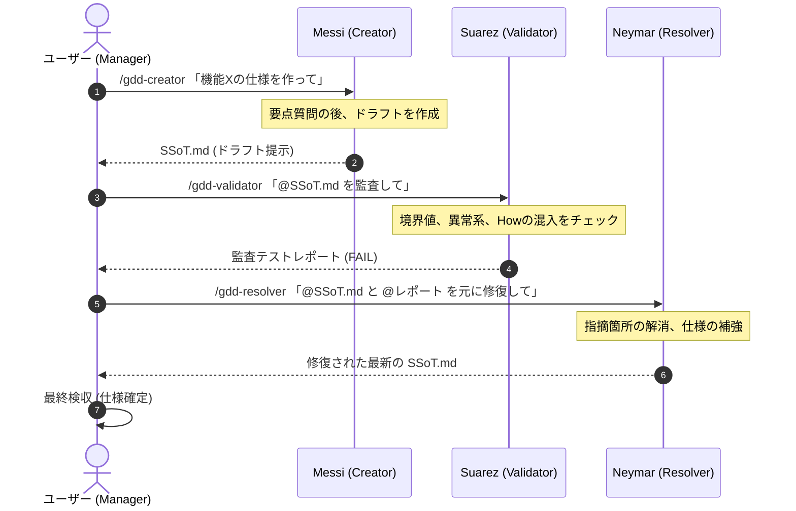

# msn-spec (GDD AI協調スキル)

サッカー史上最強と評される3トップ「MSN」のように、3つの自律的なAIエージェントが抜群のコンビネーションでバグを封じ込め、完璧な仕様書を組み上げるための保証駆動開発（GDD: Guarantee-Driven Development）AIスキルパッケージです。

`npx skills` 規格に準拠しており、Cursor、Claude Code、Clineなどの各種AI搭載IDEにコマンド一発でインストールできます。

---

## ⚽ MSN 協調メタファーコンセプト


### 🇦🇷 Messi (Creator / 仕様作成) — `gdd-creator`
* **役割**: 天才的な視野と高精度なパスで、無から完璧なチャンス（高純度なSSoT設計図）をビルドアップする。
* **機能**: 雑多なメモやアイデアから、不必要なノイズを取り除き、入力・出力・不変条件を厳格に定義した `SSoT.md` のドラフトを作成します。

### 🇺🇾 Suárez (Validator / 品質監査) — `gdd-validator`
* **役割**: 貪欲に相手の隙（仕様の脆弱性や境界エラー）を狙い、獰猛なプレッシングでバグをあぶり出す。
* **機能**: 作成された `SSoT.md` を、境界値、異常系、非機能要件、およびWhatとHowの混入などの観点から厳格に監査し、抜け漏れをリストアップしたテストレポートを出力します。

### 🇧🇷 Neymar (Resolver / 自動修復) — `gdd-resolver`
* **役割**: 圧倒的な創造性とステップで、詰んだ状況（Validatorのエラーレポート）を自律的に打開し、ゴールへと繋げる。
* **機能**: 仕様書と監査エラーリストを読み込み、矛盾なく論理的に修復された最新の `SSoT.md` へとアップデートします。

---

## 📦 インストール方法

プロジェクトのルートディレクトリで以下のコマンドを実行します。

```bash
# 3つのGDD協調スキルを一括インストール
npx skills add sawadeeeeen/msn-spec

# 特定のスキル（例: validatorのみ）を個別インストールする場合
npx skills add sawadeeeeen/msn-spec --skill gdd-validator
```
### 💡 各IDEにおける自動連携
`npx skills` を実行すると、Cursor、Claude Code、ClineなどのIDEが参照する設定フォルダ（`.agents/skills/` や `.cursor/skills/` など）に各スキルが自動配置され、シームレスに利用可能になります。

#### 📂 インストールスコープについて
* **プロジェクトローカル（推奨・デフォルト）**:
  対象プロジェクトのルートディレクトリで実行すると、そのプロジェクト配下にのみインストールされ、対象のプロジェクトを開いている時だけスキルが有効になります（他のプロジェクトを汚染しません）。
  ```bash
  npx skills add sawadeeeeen/msn-spec
  ```
* **グローバル（PC全体）**:
  ご自身のPC上のすべてのプロジェクトで横断的にこのスキルを使用したい場合は、`-g` オプションを付与してグローバルインストールします。
  ```bash
  npx skills add sawadeeeeen/msn-spec -g
  ```

---

## 🔄 AIエージェントとの協調フロー（使い方）

ユーザーはプロジェクトの**「Manager（監督）」**として、3つのスキル（Messi, Suárez, Neymar）にパスを出し、最終的に検証・修復された高品質な `SSoT.md` を検収します。

### 🏃‍♂️ 基本的な協調フロー



---

### 📥 呼び出しコマンドと指示例

#### 1. 仕様の作成 (Messi / `gdd-creator`)
ユーザー（Manager）が最初の要求をパスします。質問によるすり合わせを経てドラフトを作成します。
```text
/gdd-creator
「新規会員登録における、メールアドレス重複チェック機能を追加したい。仕様ドラフトを作って」
```

#### 2. 仕様の品質監査 (Suárez / `gdd-validator`)
生成された `SSoT.md` をインプットにして呼び出します。
```text
/gdd-validator
@SSoT.md を徹底的にレビューして、考慮漏れやHowの混入、境界値エラーがないかテストレポート（監査エラーリスト）を出して。
```

#### 3. 仕様の自動修復 (Neymar / `gdd-resolver`)
監査エラー（FAIL）が出た場合、自動修復を指示します。
```text
/gdd-resolver
@SSoT.md と @gdd-validatorのレポート を元に、SSoT仕様書を自動修復してクリーンにアップデートして。
```

#### 4. Managerによる最終検収
修復が完了し、`SSoT.md` がクリーンになった段階で、Manager（あなた）が最終的な仕様の整合性とビジネス要求の合致を確認し、仕様を確定（検収）します。

